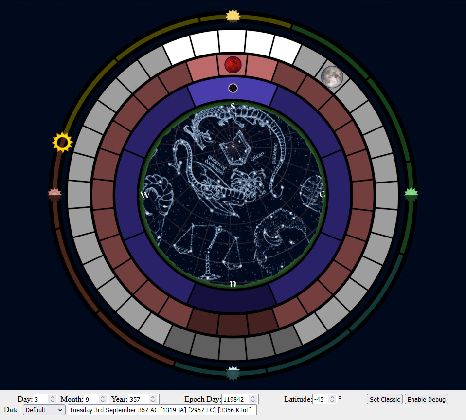

# HtmlKrynnEphemeris

A simple graphic ephemeris for Krynn, which can be used to determine, for any date, the position of the three moons, using both the classic moon phases, or the Taladas moon phases (which I prefer).

## Design Choices

Everything starts at zero, as proper, even if it is "adjusted" later. The first year after the Cataclysm is 0 RC (Real Calendar), which is 1 AC. (It just makes calculations easier). -1 RC is thus -1 PC (I keep the minus for clarity's purposes)

So, the only date usable for RPG purpose is the Date field, which gives the full date, from weekday to year. For now, it supports the "AC" and "PC" suffix, as well as "IA" (Istarian Calendar), "EC" (Ergothian Calendar) and "KToL (Kender's Time of Light Calendar).

### Order and Design

According to the official canon, the Krynnish year is 336 days long. The periods of the moons are 36 days for Solinari, 28 days for Lunitari, and 8 days for Nuitari. Fun fact: The period of Lunitari is the same as the Month's length.

Now, let's assume, as the world has been built with order-crazy gods, that everything is ordered, and fall neatly into place. There's no rounding anywhere, no leap days. The years is *exactly* 336 days, and the periods of all moons are *strict integer multiples* of days, too. This leads to a few curiosities: The three moons have an overall cycle of 504 days (which is *exactly* 1.5 year). In other words, every 504 days, the moon reappear in the sky exactly in the same position as 504 days before.

From there, we can do the following extrapolations (that are deemed to be true in my campaign):

First, let's postulate that the 1th January is always a Sunday.

Second, Let's postulate that, as the Month is of the same length as Lunitari's period, either the 1st day, or the last day, of any Month has a relevant Lunitari phase, either a Full Moon or a New Moon. Let's make it so the very first sliver of Lunitari's red waxing crescent is the 1st. It means Lunitari's New Moon happens on the 27th of every month. (As Solinari and Nuitari periods are unrelated to weeks, or months, or even years, their exact position cannot be important because it would not be stable in the calendar)

The Cataclysm happens on the 3rd day of the year 1 AC, i.e. Tuesday the 3rd (as described here: https://dragonlance.fandom.com/wiki/Cataclysm). Also, Yule is 10 days before the new year (as described here: https://dragonlance.fandom.com/wiki/0_PC), which means it starts the Thursday 19th of December. (\*)

(\*) *This is contradicted by the Wiki (https://dragonlance.fandom.com/wiki/December), which confirms Yule is the Winter Solstice, but contradicts when it says it happens December 22. This last information will be ignored because it was probably "decided" at a time the Dragonlance designers still used 31-days December months.*

So we can assume every Thursday 19th December is the winter solstice (i.e. the middle of winter). This means every Thursday 19th June is the Summer Solstice, and that every Thursday 19th March is the Spring Equinox, and every Thursday 19th September is the Autumn Equinox.

So we can define our Epoch as Day 0 or year 0 of our Real Calendar as The Sunday 1th of January of 1 AC, where Lunitari is at its Phase day 15.

, the three moons were full, and most probably, during a Night of the Eye. This nicely places Lunitari's full moon as the start of every month. This date can be the Epoch of this Calendar (and is, in my campaign).

This thus means that in the 2 september 357 AC of my campaign is "Monday 2nd October 357 AC", and that Solinari and Lunitari are full, while Nuitari is waxing crescent.
